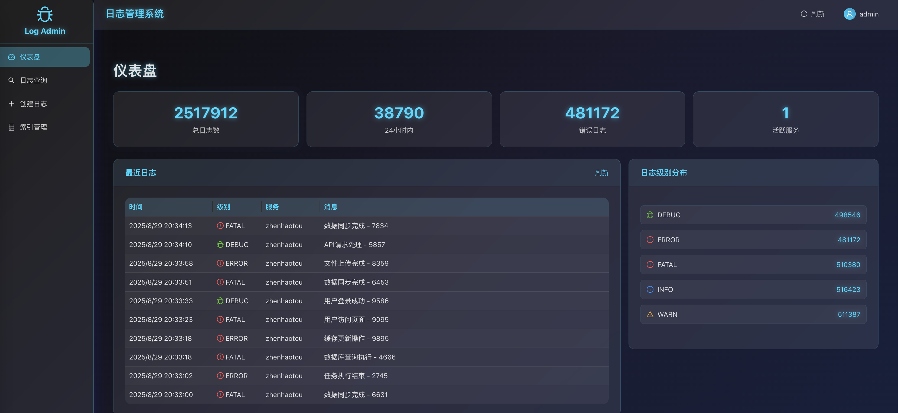

# Log Service - 高性能日志服务



基于 gRPC + MongoDB + Docker 构建的高性能日志服务，支持非阻塞日志写入和灵活的日志查询。现已集成 Web 管理界面！

## ✅ 功能特性

- [x] **核心服务**：gRPC + MongoDB + Docker
- [x] **日志管理**：日志写入、灵活查询 gRPC 服务
- [x] **高性能**：非阻塞设计，队列缓冲和批量写入
- [x] **容器化**：Docker Compose 一键部署
- [x] **🆕 Web 管理界面**：科技感 React + Gin 管理后台
- [x] **🆕 身份认证**：JWT 令牌认证，多用户角色管理
- [x] **🆕 可视化查询**：直观的日志查询和实时统计
- [x] **🆕 用户管理**：安全的登录系统，用户会话管理
- [x] **🆕 响应式设计**：完美适配桌面和移动端界面

## 🎯 新增功能：Admin 管理界面

### 🔐 登录系统
- **JWT认证**：安全的令牌认证机制
- **多用户支持**：支持不同角色的用户管理
- **会话管理**：24小时令牌有效期，自动登出保护
- **用户界面**：现代化的登录界面和用户信息显示

### 🌟 界面特色
- **科技感设计**：深色主题 + 霓虹蓝色调，毛玻璃效果
- **实时查询**：多条件组合查询，精确到时分秒
- **统计仪表盘**：日志数量、级别分布、服务统计
- **响应式布局**：完美适配桌面和移动端
- **用户体验**：直观的操作界面，完善的交互反馈

### 🚀 快速启动 Admin
```bash
# 启动包含管理界面的完整服务
./admin/start-admin.sh

# 或使用 docker-compose
docker-compose up --build -d
```

### 📱 访问地址
- **管理界面**: http://localhost:3000
- **后端API**: http://localhost:8080
- **原gRPC服务**: grpc://localhost:50051

### � 默认登录账户
系统预设了三个不同角色的默认账户：

| 用户名 | 密码 | 角色说明 |
|--------|------|----------|
| `admin` | `admin123` | 管理员账户，拥有完整权限 |
| `operator` | `op456789` | 操作员账户，日常操作权限 |
| `viewer` | `view123` | 查看者账户，只读权限 |

> ⚠️ **安全提醒**：生产环境请务必修改 `admin/backend/config.yml` 中的默认密码和JWT密钥！

### �🔧 验证服务
```bash
# 验证所有服务是否正常
./admin/verify-admin.sh

# 测试登录接口
curl -X POST http://localhost:8080/auth/login \
  -H "Content-Type: application/json" \
  -d '{"username":"admin","password":"admin123"}'
```

## 🏗️ 架构设计

### 核心组件

1. **gRPC 服务层** - 对外提供日志写入和查询接口
2. **队列管理器** - 实现非阻塞的日志写入，使用内存队列缓冲
3. **批量处理器** - 定期批量写入日志到 MongoDB，提升性能
4. **MongoDB 存储** - 高性能文档数据库，支持复杂查询和索引

### 非阻塞设计

- **内存队列缓冲**：日志写入请求先进入内存队列，立即返回
- **批量写入**：后台定期批量写入到 MongoDB，减少I/O开销
- **队列满保护**：队列满时丢弃新日志，保护服务稳定性

## 🚀 快速开始

### 方式一：使用启动脚本（推荐）

```bash
# 一键启动服务
./start.sh
```

### 方式二：使用 Docker Compose

```bash
# 构建并启动服务
docker-compose up --build -d

# 查看服务状态
docker-compose ps

# 查看日志
docker-compose logs -f log-service
```

### 方式三：使用 Makefile

```bash
# 安装 protobuf 工具
make install-protoc-tools

# 设置开发环境
make setup

# 启动 Docker 服务
make docker-up

# 查看日志
make docker-logs
```

## 📋 服务信息

启动完成后，服务将在以下端口运行：

- **日志服务 gRPC 端口**: `50051`
- **MongoDB 端口**: `27017`

## 🧪 测试客户端

项目包含了完整的测试客户端，演示如何使用各种API：

```bash
# 构建并运行测试客户端
make run-client

# 或者手动构建
go build -o bin/client examples/client.go
./bin/client
```

测试客户端将演示：
- 单条日志写入
- 批量日志写入  
- 按服务名查询
- 按日志级别查询
- 按 trace_id 查询

## 🎨 Web 管理界面功能详解

### 📊 Dashboard 仪表盘
- **实时统计**：显示总日志数、今日新增、服务数量等关键指标
- **级别分布**：饼图展示各日志级别的分布情况
- **趋势图表**：展示日志数量的时间趋势
- **服务监控**：监控各服务的日志产生情况

### 🔍 日志查询页面
- **多条件查询**：支持服务名、日志级别、时间范围、关键词等条件
- **精确时间选择**：支持精确到时分秒的时间范围选择
- **实时结果**：查询结果实时刷新，支持分页浏览
- **导出功能**：支持查询结果的导出和下载
- **高级过滤**：支持元数据过滤器和trace_id精确查找

### ✍️ 日志创建页面
- **可视化表单**：直观的日志创建界面
- **级别选择**：下拉选择日志级别
- **元数据编辑**：灵活的键值对元数据编辑
- **实时预览**：实时预览将要创建的日志内容

### 🔐 用户认证系统
- **安全登录**：JWT令牌认证，24小时有效期
- **用户信息**：显示当前登录用户信息
- **会话管理**：自动续期和安全登出
- **权限控制**：基于角色的访问控制（RBAC）

### 🎯 技术特色
- **响应式设计**：完美适配各种屏幕尺寸
- **科技主题**：深色主题配合霓虹蓝设计
- **毛玻璃效果**：现代化的视觉效果
- **平滑动画**：优雅的页面过渡和交互动效
- **高对比度**：优化的下拉框和选择器对比度

## 📖 API 接口

### gRPC 服务定义

```protobuf
service LogService {
  // 写入单条日志
  rpc WriteLog(WriteLogRequest) returns (WriteLogResponse);
  
  // 批量写入日志
  rpc BatchWriteLog(BatchWriteLogRequest) returns (BatchWriteLogResponse);
  
  // 查询日志
  rpc QueryLog(QueryLogRequest) returns (QueryLogResponse);
}
```

### 日志级别

- `DEBUG` = 0
- `INFO` = 1  
- `WARN` = 2
- `ERROR` = 3
- `FATAL` = 4

### 查询功能

支持以下查询条件：
- 服务名称
- 日志级别
- 时间范围（start_time, end_time）
- 元数据过滤器
- trace_id
- 分页（limit, offset）

## ⚙️ 配置选项

### gRPC 服务配置
服务支持通过环境变量进行配置：

| 环境变量 | 默认值 | 说明 |
|---------|-------|------|
| `SERVER_PORT` | 50051 | gRPC 服务端口 |
| `MONGODB_URI` | mongodb://localhost:27017 | MongoDB 连接URI |
| `MONGODB_DATABASE` | log_service | MongoDB 数据库名 |
| `LOG_BUFFER_SIZE` | 1000 | 日志队列缓冲区大小 |
| `LOG_FLUSH_PERIOD` | 5 | 批量写入周期（秒） |
| `LOG_BATCH_SIZE` | 100 | 单次批量写入数量 |

### Web 管理界面配置
管理界面配置文件位于 `admin/backend/config.yml`：

```yaml
admin:
  users:
    admin: "admin123"        # 管理员账户
    operator: "op456789"     # 操作员账户  
    viewer: "view123"        # 查看者账户
  jwt:
    secret: "your-super-secret-jwt-key-change-this-in-production"
    expires_hours: 24        # JWT令牌有效期
```

### 端口分配
| 服务 | 端口 | 说明 |
|------|------|------|
| Web管理界面 | 3000 | 前端React应用 |
| 管理后端API | 8080 | 认证和管理API |
| gRPC日志服务 | 50051 | 核心日志服务 |
| MongoDB | 27017 | 数据库服务 |

## 📁 项目结构

```
.
├── main.go                      # gRPC服务入口
├── admin/                       # 🆕 Web管理界面
│   ├── backend/                 # 管理后端 (Gin + JWT)
│   │   ├── main.go             # 认证服务入口
│   │   ├── auth.go             # JWT认证逻辑
│   │   ├── handlers.go         # API处理器
│   │   └── config.yml          # 用户配置文件
│   ├── frontend/               # 管理前端 (React + TypeScript)
│   │   ├── src/
│   │   │   ├── components/     # 通用组件
│   │   │   ├── pages/          # 页面组件
│   │   │   ├── utils/          # 工具函数
│   │   │   └── App.tsx         # 主应用组件
│   │   ├── public/
│   │   ├── package.json
│   │   └── nginx.conf          # Nginx配置
│   ├── start-admin.sh          # 管理界面启动脚本
│   └── verify-admin.sh         # 服务验证脚本
├── proto/                       # protobuf 定义
│   ├── log_service.proto       # gRPC服务定义
│   ├── log_service.pb.go       # 生成的Go代码
│   └── log_service_grpc.pb.go  # 生成的gRPC代码
├── internal/                    # 内部包
│   ├── config/                 # 配置管理
│   ├── storage/                # MongoDB存储层
│   ├── queue/                  # 日志队列管理
│   └── service/                # gRPC服务实现
├── examples/                    # 示例代码
│   ├── client.go               # gRPC测试客户端
│   └── performance_test.go     # 性能测试
├── clients/                     # 多语言客户端
│   ├── python/                 # Python客户端
│   └── typescript/             # TypeScript客户端
├── scripts/                     # 脚本文件
│   ├── init-mongo.js           # MongoDB初始化
│   └── create-indexes.js       # 索引创建脚本
├── docker-compose.yml          # 完整服务编排
├── docker-compose-admin.yml    # 管理界面独立编排
├── docker-rebuild.sh           # 🆕 智能重建脚本
├── Dockerfile                  # gRPC服务镜像
├── Makefile                    # 构建脚本
└── start.sh                    # 服务启动脚本
```

## 🛠️ 开发

### 本地开发环境

1. 安装依赖：
```bash
go mod download
```

2. 安装 protobuf 工具：
```bash
make install-protoc-tools
```

3. 生成 protobuf 代码：
```bash
make proto
```

4. 启动 MongoDB（使用 Docker）：
```bash
docker run -d --name mongodb -p 27017:27017 mongo:7.0
```

5. 运行服务：
```bash
make run
```

### 构建命令

```bash
# 清理构建文件
make clean

# 生成 protobuf 代码
make proto

# 构建应用
make build

# 运行测试
make test

# 构建 Docker 镜像
make docker-build
```

## 🔧 运维管理

### 查看服务状态

```bash
# 查看容器状态
docker-compose ps

# 查看服务日志
docker-compose logs log-service

# 查看 MongoDB 日志
docker-compose logs mongodb
```

### 停止服务

```bash
# 停止所有服务
docker-compose down

# 或使用 Makefile
make docker-down
```

### 数据持久化

MongoDB 数据存储在 Docker volume `mongodb_data` 中，停止容器不会丢失数据。

如需完全清理：
```bash
docker-compose down -v  # 删除 volumes
```

## 🚨 生产环境建议

### 🔒 安全配置
1. **管理界面安全**：
   - ⚠️ **必须修改** `admin/backend/config.yml` 中的默认密码
   - ⚠️ **必须更换** JWT密钥为复杂随机字符串
   - 配置 HTTPS 证书，启用 SSL/TLS 加密
   - 限制管理界面访问IP范围

2. **数据库安全**：
   - 修改 MongoDB 默认密码
   - 启用 MongoDB 认证机制
   - 使用 TLS 加密 gRPC 连接
   - 配置防火墙规则

### 🎯 性能优化
1. **日志服务优化**：
   - 根据日志量调整队列缓冲区大小
   - 优化 MongoDB 索引策略
   - 考虑使用 MongoDB 分片集群

2. **Web界面优化**：
   - 启用 Nginx Gzip 压缩
   - 配置静态资源缓存策略
   - 使用 CDN 加速前端资源

### 📊 监控与运维
1. **服务监控**：
   - 添加 Prometheus metrics
   - 配置日志告警机制
   - 监控队列堆积情况
   - 设置用户登录监控

2. **高可用部署**：
   - 部署多个服务实例
   - 使用 MongoDB 副本集
   - 配置负载均衡器
   - 设置容器健康检查

### 🛠️ 运维工具
```bash
# 智能重建特定服务
./docker-rebuild.sh admin-frontend  # 仅重建前端
./docker-rebuild.sh admin-backend   # 仅重建后端
./docker-rebuild.sh log-service     # 仅重建日志服务

# 查看服务状态
docker-compose ps
docker-compose logs -f [service-name]

# 备份用户配置
cp admin/backend/config.yml admin/backend/config.yml.backup
```

## 📝 使用指南

### 🎯 管理界面使用流程
1. **登录系统**：使用预设账户或自定义账户登录
2. **查看仪表盘**：了解系统整体状态和日志统计
3. **查询日志**：使用多条件查询功能精确定位日志
4. **创建日志**：通过可视化表单创建测试日志
5. **用户管理**：查看当前用户信息，安全退出

### 🔍 高级查询技巧
- **时间精确查询**：支持到时分秒的精确时间范围
- **组合条件**：多个查询条件可以同时使用
- **元数据过滤**：使用键值对进行精确过滤
- **批量导出**：查询结果支持批量下载

### 🎨 界面个性化
- **主题一致性**：深色科技主题，护眼且专业
- **响应式设计**：自动适配不同设备屏幕
- **快捷操作**：支持键盘快捷键和批量操作
- **实时反馈**：所有操作都有即时的视觉反馈

## 🤝 贡献指南

欢迎提交 Issue 和 Pull Request 来改善项目！

### 开发环境设置
```bash
# 安装依赖
make setup

# 启动开发环境
make dev

# 运行测试
make test
```

### 提交规范
- feat: 新功能
- fix: 修复问题
- docs: 文档更新
- style: 代码格式调整
- refactor: 代码重构
- test: 测试用例
- chore: 构建过程或辅助工具的变动

---

## 📄 许可证

本项目采用 MIT 许可证。详情请查看 [LICENSE](LICENSE) 文件。

---

## 🏷️ 版本历史

- 🆕 新增Web管理界面，JWT认证系统，可视化查询
- 添加多语言客户端支持
- 优化批量写入性能
- 初始版本，基础gRPC日志服务
